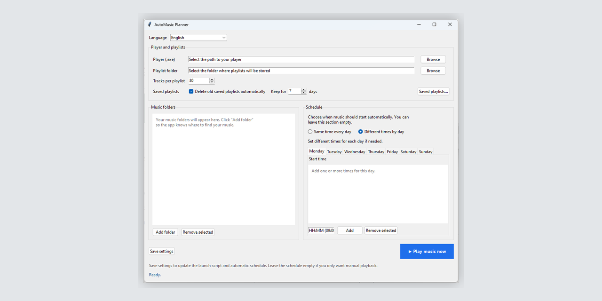

# AutoMusic Planner

**Version:** v1.0.0  
**Platform:** Windows

Windows desktop app for smart playlist generation and scheduled music playback.

AutoMusic Planner is a small Windows desktop utility that builds a fresh random playlist from your music folders, saves it as `.m3u`, and launches your preferred media player.

It can also start music automatically on a schedule using Windows Task Scheduler.

## Download

Download the latest version here:
https://github.com/mixerlandgroup-afk/automusic-planner/releases/tag/v1.0.0

## How it works

1. You choose your preferred player executable.
2. You choose a folder where playlists will be stored.
3. You add one or more folders with music.
4. The app creates a PowerShell launch script based on your settings.
5. When you press **Save settings**, the app saves the configuration and updates the automatic schedule if you entered one.
6. When you press **Play music now**, the app creates a new playlist and launches your player immediately.

## Saved playlists history

AutoMusic Planner keeps two kinds of playlists:

- `automusic_latest.m3u` — the newest playlist used for immediate playback
- archived playlists in `saved_playlists\` with date and time in the filename

Example:

- `saved_playlists\automusic_2026-03-29_11-30-00.m3u`

You can open the **Saved playlists…** window to:

- play an older saved playlist
- open the saved-playlists folder
- delete a saved playlist

## Automatic cleanup of old saved playlists

By default, automatic cleanup is enabled.

This means old archived playlists are deleted automatically after the selected retention period. The default setting is **7 days**.

This helps avoid filling the disk with too many old playlist files.

## Recommended players

AutoMusic Planner works best with media players that can open a local `.m3u` or `.m3u8` playlist file directly from the command line.

Recommended and tested players: foobar2000, VLC, MusicBee, AIMP.

Other players may also work if they support opening playlist files via executable path + playlist file argument.

## Requirements

Please install these programs before using AutoMusic Planner:

- Python 3 for Windows
- a media player that supports opening `.m3u` playlists

Recommended:

- foobar2000

## Launching the app

Recommended launcher: `automusic_gui.bat`

- If Python is installed, it starts AutoMusic Planner.
- If Python is missing, it opens the official Python download page and shows a short message explaining that Python must be installed first.
- You can still run `automusic_scheduler_gui.pyw` directly on systems where `.pyw` files are already associated with Python.

## Main files

- `automusic_scheduler_gui.pyw` — the main application
- `automusic_config.json` — saved settings file, created after the first save
- `run-automusic-planner.ps1` — generated launch script, created automatically after saving settings

## User workflow

### Manual use

1. Open `automusic_scheduler_gui.pyw`
2. Select your player
3. Select your playlist folder
4. Add music folders
5. Optionally change the number of tracks per playlist
6. Optionally configure old-playlist cleanup
7. Press **Save settings**
8. Press **Play music now**

### Automatic use

1. Open `automusic_scheduler_gui.pyw`
2. Fill in the player, playlist folder, and music folders
3. Set your schedule
4. Press **Save settings**

After that, music will start automatically according to your schedule.

## Schedule modes

The app supports two schedule modes:

- **Same time every day**
- **Different times by day**

You can leave the schedule section empty if you only want manual playback.

## Notes

- The app is designed for Windows.
- The schedule is created through Windows Task Scheduler.
- The app does not require any cloud service.
- If you move the app to another computer, update the player path, playlist folder, and music folders.

## Portable use on another PC

To use the app on another Windows computer:

1. Install Python 3
2. Install your preferred media player
3. Copy `automusic_scheduler_gui.pyw` to the new computer
4. Start the app
5. Set the player path, playlist folder, and music folders
6. Press **Save settings**

The app will create a new config file and a new launch script on that computer.
## Feedback

If you find a bug or want to suggest an improvement, please open an issue:
https://github.com/mixerlandgroup-afk/automusic-planner/issues
